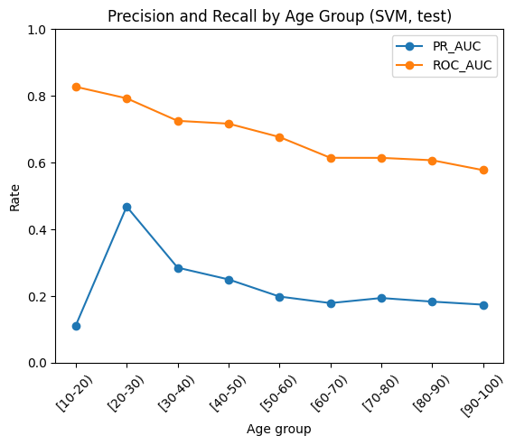

# 30-Day Hospital Readmission Risk (Classification)

## Problem
Hospitals want to identify patients at higher risk of being readmitted within 30 days after discharge, so resources (follow-up calls, care coordination, education) can be targeted efficiently.

This project builds and evaluates binary classifiers that predict 30-day readmission from discharge-time features.

## Data
- Source: [UC Irvine Machine Learning Repository]
- Unit of analysis: one hospital encounter (one admission/discharge record) for a patient, with demographics (race/sex/age), visit/admin info (admission/discharge/source), utilization (time in hospital, prior visits), diagnoses (diag_1–3, number_diagnoses), medication features (diabetes drugs/insulin/change/diabetesMed), and outcomes (readmitted and derived label readmit_30). A patient can show up in multiple rows if they had multiple encounters.
- Rows: 101766
- Features: 196 after preprocessing (one-hot encoding, etc.)
- Notes: 
  - Dataset is imbalanced (readmission is the minority class).
  - Some categorical fields are encoded (e.g., age bands like `[60-70)`).

## Target definition
`readmit_30 = 1` if the patient is readmitted within 30 days, else `0`.

Train/validation/test split:
- Train: 70%
- Validation: 15%
- Test: 15%
Stratified split to preserve class imbalance.

## Modeling approach
Models evaluated:
- Logistic Regression (class-weight tuning)
- KNN (with oversampling / pipeline tuning)
- Calibrated Linear SVM (C tuning + probability calibration)

Selection metric (tuning): **PR-AUC** (better for imbalanced targets).  
Operating point: choose threshold on validation to **maximize precision subject to recall ≥ 0.70**.

## Baseline model results (ranking performance)
Validation:
- Logistic Regression: ROC-AUC = 0.6393829240157833, PR-AUC = 0.1918235303905126
- KNN (pipeline  tuning): ROC-AUC = 0.6179632774141903, PR-AUC = 0.17810913971890988
- Calibrated Linear SVM: ROC-AUC = 0.6405925662036417, PR-AUC = 0.19294614212081912

Test:
- Logistic Regression: ROC-AUC = 0.6447495718355558, PR-AUC = 0.19951418158480766
- KNN: ROC-AUC = 0.6214697854555993, PR-AUC = 0.18434197842480576
- Calibrated Linear SVM: ROC-AUC = 0.6450336299932179, PR-AUC = 0.20052394468911977

Interpretation: PR-AUC summarizes precision–recall performance across thresholds and is more informative than ROC-AUC under class imbalance.

## Threshold tradeoffs (operational behavior)
Even with a good PR-AUC, deployment depends on the threshold (how many alerts are triggered).

Using the chosen validation threshold rule (recall ≥ 0.70), the test-set operating metrics were:

- Logistic Regression:
    - threshold = 0.5705008883338997
    - precision = 0.1468685142229276
    - recall = 0.7064004697592484
    - flag rate = 0.5365869636423191  (fraction predicted positive)

- KNN (pipeline tuning):
    - threshold = 0.16064548376443422
    - precision = 0.13665230210932183
    - recall = 0.7075748678802114
    - flag rate = 0.5776613167376351

- Calibrated Linear SVM:
    - threshold = 0.09
    - precision = 0.13975089719231581
    - recall = 0.7774515560775103
    - flag rate = 0.6206354405502784

Interpretation: Meeting recall ≥ 0.70 requires flagging ~54–62% of encounters across models (i.e, ~54–62 alerts per 100 discharges), implying high alert volume and a heavy operational burden unless capacity or downstream workflow is expanded. 

## Subgroup performance (age bands)
A subgroup check tested whether performance differs by age band on the **test set** using the same SVM threshold. 
Ranking metrics (PR-AUC/ROC-AUC) are threshold-free; precision/recall/flag-rate depend on the chosen threshold.




Summary (SVM, test set, by age band):

  - Operating metrics at a fixed threshold are not uniform across ages. Recall varies meaningfully by age band (peaks around [20–30) and stays high in several older bands), while precision stays low across bands (expected under class imbalance). This implies a fixed threshold yields different sensitivity across subgroups.
      
  - Ranking quality differs by age band. PR-AUC is highest for [20–30) and generally declines in older bands, while ROC-AUC also trends downward with age. This suggests the model separates positives from negatives better in some age groups than others, not just a threshold effect.
      
  - Small-sample bands are unstable. The youngest bands have very small n / few positives, making estimates noisy (and in some bands metrics can be undefined or unreliable).

## SQL mini (data fluency)
Loaded features and labels into SQLite and wrote queries (rates by subgroup, risk by LOS, discharge disposition, confusion matrix for a rule-based baseline, etc.).

See: `sql_readmission_case.md`

## Limitations (prediction ≠ causation)
- This is a **predictive** model, not a causal claim.
    - Example: if `time_in_hospital` is associated with higher readmission risk, that does **not** mean increasing LOS causes readmission.
    - Many variables reflect severity/support needs and act as proxies.
- Threshold choice is operational:
    - A model can have strong ranking performance but still be impractical if it flags too many patients.
- Dataset limitations:
    - Dataset is from a single health system and is relatively old (1999-2008); feature definitions/coding may not match current workflows.
    - Many clinically important post-discharge variables are missing (follow-up access, social support, outpatient care).
    - Some variables may be proxies for severity or care process, so interpretation must be cautious.
- Feature availability:
    - Some features might not be available at discharge time in real workflows.

## How to run

### 1) Create environment + install
```bash
python -m venv .venv
source .venv/bin/activate  # mac/linux
# or: .venv\Scripts\activate  # windows
pip install -r requirements.txt
```
### 2) Run notebooks

Open Jupyter and run in order:
- 01_readmission_data.ipynb
- 02_readmission_ML.ipynb (modeling + evaluation)
- 03_sql.ipynb (SQLite load + queries)
- 04_eda_readmission.ipynb (EDA plots + insights)
```bash
jupyter notebook
```
